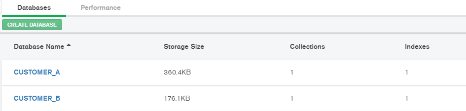
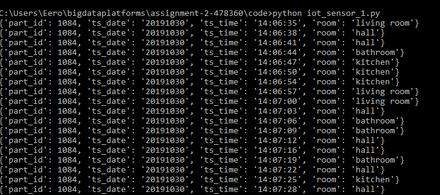
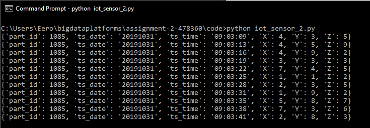
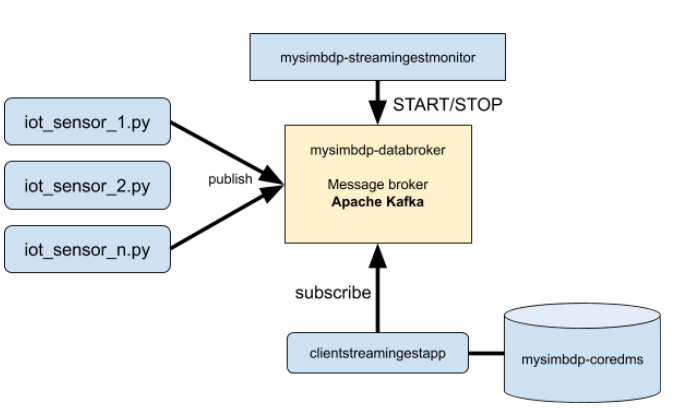
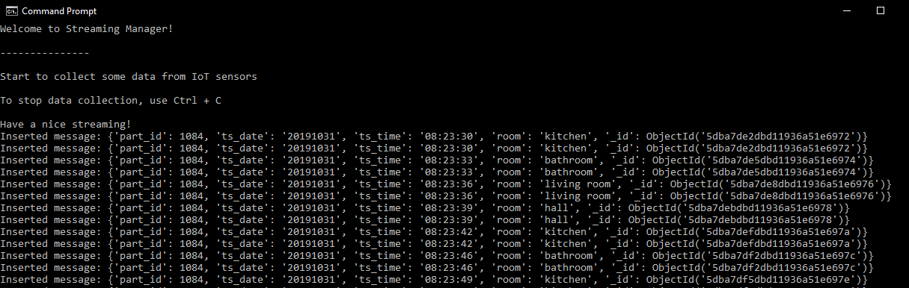
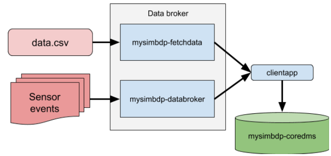
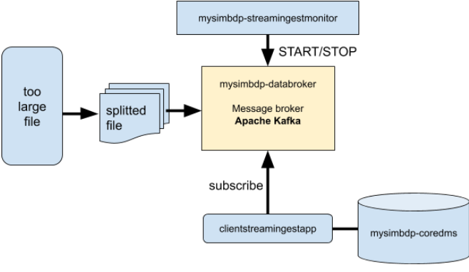

## System Design
This big data platform is designed to receive and store data from IoT sensors. An example data set used in demonstrate this platform is indoor location detection dataset. However, other types of IoT sensor events should be allowed if they follows the structure of messages. Because of limited time, this platform accepts only structured sensor data.

Data reference: Ilias Kalamaras. (2019). Indoor Localization Dataset [Data set]. Zenodo. http://doi.org/10.5281/zenodo.2671590

### Part 1 - Ingestion with batch

#### 1. Constraints of files
Number of files: 5
Data sizes: 200000 bytes

__constraints.json__
```json
{
  "number_of_files": 5,
  "file_size": 200000
}
```
Also, there could be more constraints about data type, document type and other restrictions. However, in this naive implementation only these two constraints are taken into account. In this configuration, a customer is allowed to ingest only five files and a maximum size of a file is limited to 200000 bytes.

#### 2. Data staging
Customer's files to be ingested are in __client-input-directory__. Data should be not saved into the database __mysimbdp-coredms__ yet. In this stage, a pandas dataframe is initialized with customer's data.

First, constraints are checked from __constraints.json__ file and customer's gives a path for data directory. Files (filenames) that satisfy the constraints are saved and data from these files will be inserted into a pandas dataframe.

__mysimbdp.fetchdata()__
```python
import json
import os
from os import listdir
from pandas import DataFrame
from pandas import read_csv

def fetchdata(directory_path):
    '''
    This method implements the mysimbdp-fetchdata
    '''
    # input: directory path as a string
    # output: staged file contents in a pandas dataframe
    # read constraint configuration file
    with open('constraints.json') as file:
        constraints = json.load(file)

    max_size = constraints['file_size']
    max_files = constraints['number_of_files']
    n = 0 # number of iterations
    files = []
    # go through files in client-input-directory
    # calculate size of files and the number of files
    # if either of constraints is fulfilled, the execution stops
    # also, create a log file
    ts_date = datetime.today().strftime('%Y%m%d-%H%M%S')
    log_file_name = "log-" + ts_date + ".log"
    log_file = open(log_file_name, 'w')

    for file in os.listdir(directory_path):
        if n == max_files:
            break
        fp = os.path.join(directory_path, file)
        if os.path.getsize(fp) <= max_size:
            files.append(fp)
            log_file.write('SUCCESS: ' + datetime.today().strftime('%Y-%m-%d-%H:%M:%S') + " " + fp + " " + str(os.path.getsize(fp)) + " bytes \n")
        else:
            log_file.write('FAILED: ' + datetime.today().strftime('%Y-%m-%d-%H:%M:%S') + " " + fp + " " + str(os.path.getsize(fp)) + " bytes \n")
            print("File " + str(fp) + " is too large (>" + str(max_size) + " bytes).")
        n += 1

    log_file.close()

    # INSERT FILE CONTENTS INTO PANDAS DATAFRAME
    df_list = []
    if len(files) > 0:
        for file in files:
            df = pd.read_csv(file)
            df_list.append(df)
        df_all = pd.concat(df_list, axis=0, ignore_index=True)
    else:
        df_all = None
    return df_all
```

__mysimbdp.insert_files__ method is used for ingest a file into the final sink (coredms).
```python
def insert_files(database_name, files):
    '''
    This method inserts a file into the final sink (coredms)
    '''
    client = MongoClient('localhost', 27017)
    # ASSUME CUSTOMER IS PUSHING DATA IN CSV FORMAT

    database = client[database_name]
    column = database["records"]
    # convert pandas DataFrame into dictionary format
    files_json = files.to_dict(orient="records")

    #insert file contents into MongoDB database
    inserted = column.insert_many(files_json)
```

#### 3. __mysimbdp-batchingestmanager__
Implemented in /code folder. The manager asks for a customer id and data directory. In this example, the only implemented customer ID:s are `A` and `B`. The data directory is the one where customer has all the files to be ingested.

Interactive consol:
```
MYSIMBDP BATCHINGESTMANAGER v0.1
Give data directory: <client-input-directory>
Give your customer ID: A
```
The source code for _mysimbdp-batchingestmanager__:

__batchingestmanager.py__
```python
from mysimbdp import fetchdata
import clientbatchingestapp_1
import clientbatchingestapp_2

def batchingestmanager(folder_dir=None,customer_ID=None):
    '''
    This method implements the mysimbdp-batchingestmanager
    '''
    #customer files to be ingested into the final sink
    print("MYSIMBDP BATCHINGESTMANAGER v0.1\n")
    if folder_dir == None and customer_ID == None:
        folder_dir = input('Give data directory: ')
        customer_ID = input('Give your customer ID:')

    files = fetchdata(folder_dir)

    if customer_ID == 'A':
        clientbatchingestapp_1.ingest(files)
    elif customer_ID == 'B':
        clientbatchingestapp_2.ingest(files)
    else:
        print("No customer found with this ID")

if __name__ == '__main__':
    batchingestmanager()
```

Model that client application should follow:
```python
from mysimbdp import insert_files

def ingest(files):
    # create database
    database_name = 'DATABASE_NAME'

    insert_files(database_name, files)
    print("Data inserted into database.")
```

#### 4. Test programs
There are two customers, __Customer A__ and __Customer B__. All of them have multiple files with IoT sensor data that they want to be ingested and stored in a database. Customers have to follow instructions set by __mysimbdp__ in designing their client apps.

To test these customers, __batchingestmanager.py__ should be executed.
The __batchingestmanager__ asks data directory and customer ID (in this case, there are only two customers A and B). However, this is very primitive system and it should be improved if wanted to have more customers.

Test logs are in /logs folder.

This snapshot is from MongoDB Compass UI, where databases can be observed. Both customer databases are succesfully created here.


More information about possible customers:

| Customer       | Industry           | Type of data     |
|----------------|--------------------|------------------|
| A              | Kindergarden    | Indoor localization data |
| B              | Rest home          | Indoor localization data |

MongoDB is used as a database in __mysimbdp-coredms__.

Data:
Ilias Kalamaras. (2019). Indoor Localization Dataset [Data set]. Zenodo. http://doi.org/10.5281/zenodo.2671590

#### 5. Logging features
The features to save log data about ingestion to mysimbdp is implemented in method __mysimbdp.fetchdata()__.
```python
ts_date = datetime.today().strftime('%Y%m%d-%H%M%S')
log_file_name = "log-" + ts_date + ".log"
log_file = open(log_file_name, 'w')

for file in os.listdir(directory_path):
    if n == max_files:
        break
    fp = os.path.join(directory_path, file)
    if os.path.getsize(fp) <= max_size:
        files.append(fp)
        log_file.write('SUCCESS: ' + datetime.today().strftime('%Y-%m-%d-%H:%M:%S') + " " + fp + " " + str(os.path.getsize(fp)) + " bytes \n")
    else:
        log_file.write('FAILED: ' + datetime.today().strftime('%Y-%m-%d-%H:%M:%S') + " " + fp + " " + str(os.path.getsize(fp)) + " bytes \n")
        print("File " + str(fp) + " is too large (>" + str(max_size) + " bytes).")
    n += 1

log_file.close()

```
This script write log data into a file with name in format:
```
log-YYYYMMDD-hhmmss.log
```
The log file rows tell about if the ingestion is successful or not (depends on constraints)
```
FAILED: YYYY-MM-DD-hh:mm:ss client-input-directory/input.csv XXXXX bytes
SUCCESS: YYYY-MM-DD-hh:mm:ss client-input-directory/input.csv XXXXX bytes
```

### Part 2 - Near-realtime ingestion
In near-realtime processing, Apache Kafka is used as a message broker.
#### 1. Message structure
In Kafka, every record should have a key, a value and a timestamp.
__ingestmessagestructure__ should be in JSON format. For example, sensor readings - one sensor reading corresponds a message. For simplicity, messages should be in certain format, because it is complicated to parse many different semantics of data. This big data platform is dedicated to IoT sensor data and therefore it should have a certain message format.

In Kafka, messages are stored in key-value format. Each message should have a topic, a partition, an offset, a key and a value.

For example, with a single message from reference dataset (Indoor Location dataset):

```
topic='REPORT',
partition=0,
offset=2,
timestamp=1572287582134,
timestamp_type=0,
key=None,
value={"value": {"part_id": 1084, "ts_date": "20191027", "ts_time": "15:14:37", "room": "hall"},
header=[],
checksum=None,
serialized_key_size=-1,
serialized_value_size=81,
serialized_header_size=-1
```
So, there should be `topic` as string and `value` as json.

An example message values streaming from simulated IoT sensors:

__iot_sensor_1.py__



__iot_sensor_2.py__




https://kafka.apache.org/documentation/#messageformat
https://towardsdatascience.com/getting-started-with-apache-kafka-in-python-604b3250aa05
#### 2. System architecture

As system is designed as seen in the following figure:


In the test implementation, simulated IoT sensors are publishing constantly data into the message broker (__mysimbdp.databroker__) and __clientstreamingestapp__ subscribes messages and save them into __mysimbdp-coredms__ database. Also, __mysimbdp__ has other helping functions that producers can utilize in their own applications.

__mysimbdp.databroker__
```python
def databroker(message, topic_name):
    '''
    This method implements the mysimbdp-databroker.
    Data should be in list where each message is in
    json format {'key': 'value'}
    '''
    # Set JSON as a message format
    producer = KafkaProducer(value_serializer=lambda m: json.dumps(m).encode('ascii'))
    topic_name = topic_name
    producer.send(topic_name, message)
    producer.flush()

```

__mysimdp.insert_coredms__
```python
def insert_coredms(database_name, message):
    '''
    This method inserts a message into the final sink (coredms)
    '''
    client = MongoClient('localhost', 27017)
    database = client[database_name]
    column = database['records']
    column.insert_one(message)
    print('Inserted message: ' + str(message))
```

__mysimbdp.subscribe_stream__
```python
def subscribe_stream(topic_name):
    '''
    This method return a Kafka consumer instance
    '''
    return KafkaConsumer(topic_name, value_deserializer=lambda m: json.loads(m.decode('ascii')))
```

__streamingestmanager.py__ is currently hard-coded to handle two customer. In the future expansion, it should be scaled to large number of customers, but this time the time window is TOO narrow to implement that.

Example consol output from __streamingestmanager__:



Implementations are in /code folder. Components implemented in this section: __streamingestmanager.py__, __mysimbdp.databroker__.

#### 3. Data ingestion
A core design includes a customer, which is creating data constantly. In this case, two IoT sensors are simulated to create data similar to `Indoor Location Detection dataset`. However, this big data platform can be used with other kinds of data too. Example events of customers:

__Customer_A__:
```json
{"part_id": 1084, "ts_date": "20191027", "ts_time": "15:14:37", "room": "hall"}
```

__Customer_B__:
```json
{"pard_id": 1085, "ts_date": "20191031", "ts_time": "09:06:06", "X": 5, "Y": 4, "Z": 7}
```
The performance log can be found from /log folder.


Customer should follow the model:
In this design, a customer can utilize methods __mysimbdp.databroker__, __mysimbdp.subscribe_stream__ and __mysimbdp.instert_coredms__ in application.

A model based on Python for customers:
```python
import time
from datetime import datetime
from datetime import timedelta
from mysimbdp import databroker, insert_coredms, subscribe_stream

def ingest(report_period=None):
    # customer's database name
    database_name = 'DATABASE_NAME'

    # establish Apache Kafka to subscribe events
    topic_name = 'TOPIC_NAME'

    consumer = subscribe_stream(topic_name)

    ts_date = datetime.today().strftime('%Y%m%d-%H%M%S')


    # report objects for ingestion
    total_size = 0

    #initalize message counter
    messages_number = 0
    ingestion_times = []
    start_time = datetime.now()
    reported = 0
    for msg in consumer:
        tic = datetime.now()
        insert_coredms(database_name, msg.value)
        toc = datetime.now()
        message = msg.value
        total_size += len(msg.value)
        messages_number += 1
        ingestion_times.append((toc-tic))
        if (datetime.now() - start_time >= report_period) and reported == 0:
            report_file = open('ingestion-report-' + str(datetime.today().strftime('%Y%m%d-%H%M%S')) + ".log", 'w')

            average_ingestion_time = report_period / messages_number
            report = {"messages": str(messages_number), "total_size": str(total_size), "average_ingestion_time": str(average_ingestion_time)}
            databroker(report, "REPORT")
            report_file.write(str(report))
            report_file.close()
            start_time = datetime.now()
            messages_number = 0


```

#### 4. Reporting
__clientstreamingestapp__ should send report to __mysimbdp-streamingestmanager__. The report should contain processing rate, average ingestion time, total ingestion data size and number of messages with predefined period of time. Currently, __clientstreamingestapp__ reports these information to .log file when the predefined time period is reached.

However, a message protocol to send report messages is similar to databroker. This means, that there could be a Kafka topic `REPORT` and report would be published in this topic. In __streamingestmanager__, parallel processing would check constantly if there are messages in that threat.
```python
# report objects for ingestion
total_size = 0
messages_number = 0
ingestion_times = []
start_time = datetime.now()

for msg in consumer:
    insterted = test_col.insert_one(msg.value)
    message = msg.value

    tic = datetime.now()
    log_file.write("INSERTED" + ';'+ str(message['part_id']) + ';'+ str(message['ts_date']) + ';'+ str(message['ts_time']) + ';'+ str(message['room']) + '\n')
    toc = datetime.now()

    total_size += len(msg.value)
    messages_number += 1
    ingestion_times.append(str(toc-tic))
    # reporting
    if (datetime.now() - start_time > report_period) and reported == 0:
        report_file = open('ingestion-report-' + str(datetime.today().strftime('%Y%m%d-%H%M%S')) + ".log", 'w')
        average_ingestion_time = report_period / messages_number
        report = {"messages": str(messages_number), "total_size": str(total_size), "average_ingestion_time": str(average_ingestion_time)}
        databroker(report, "REPORT")
        report_file.write(str(report))
        report_file.close()
        reported = 1


    print("Inserted message")
log_file.close()
```
This code produces a log file where data is in following format:
```
{'messages': '7', 'total_size': '35', 'average_ingestion_time': '0.5'}
```

### Part 3 - Integration and Extension
#### 1. Integrated architecture

In integrated structure, there could be in data broker phase two different components for each data input style. A `clientapp` combines data coming from these and subscribe to Kafka stream. Subscribed events will be saved into the __mysimbdp-coredms__ database.

#### 2. Handling too large files
If the file is too large for batch ingestion, my suggestion is to divide the file into smaller batches and send to the database as multiple batches.

However, this could be implemented also with streaming ingest method. The large file can be seen as a huge set of events and with for-loop this set can be published as individual events into the Kafka stream.



Example with `VERY_BIG_FILE.csv`:
```python
file = read_csv('VERY_BIG_FILE.csv')
topic_name = 'TOPIC_NAME'
for index, row in file.iterrows():
    message = {"part_id": row['part_id'], "ts_date": row['ts_date'], "ts_time": row['ts_time'], "room": row['room']}
    databroker(message, topic_name)
    time.sleep(1)
```

#### 3. Data sensitivity
The platform provider should not to see the customer's code because there can be sensitive information such as medical, personal or other information handled in topic names. Platform provider can give functions to handle and ingest data, but the functions just have the data as parameters and not allowed to read it.
