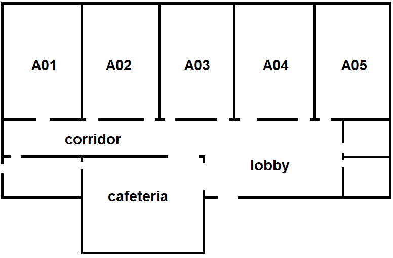
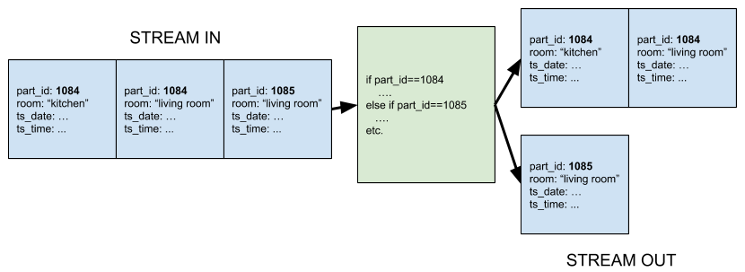
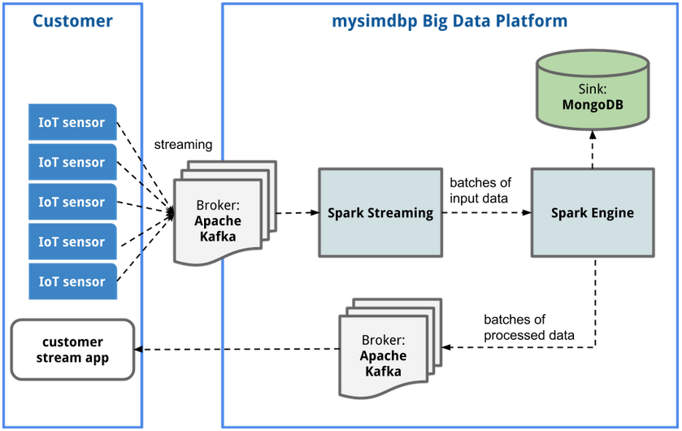
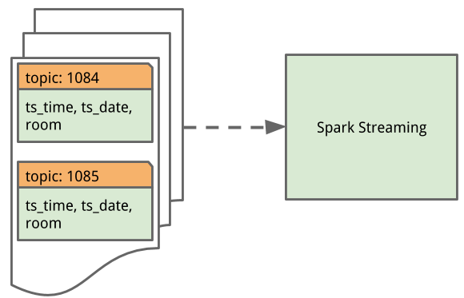
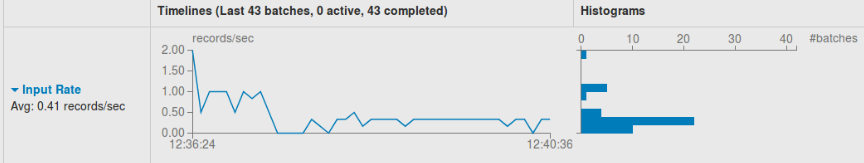
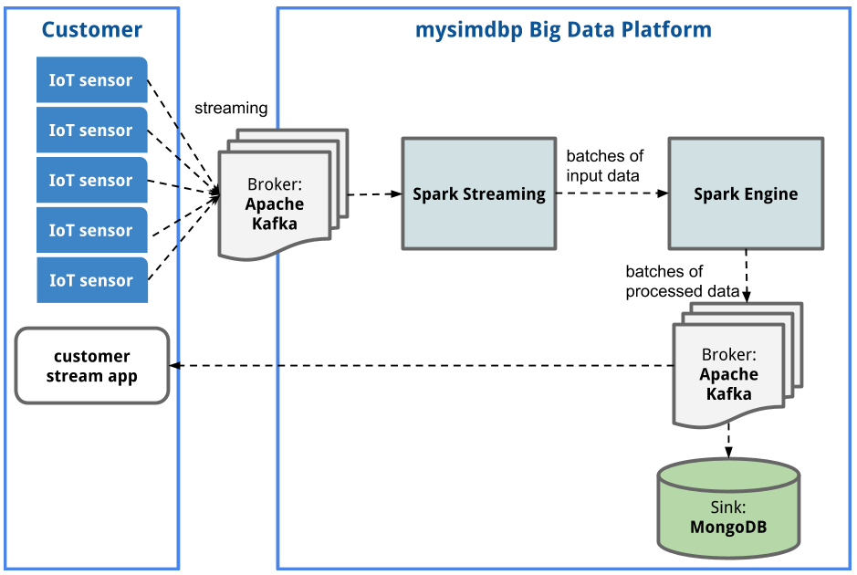
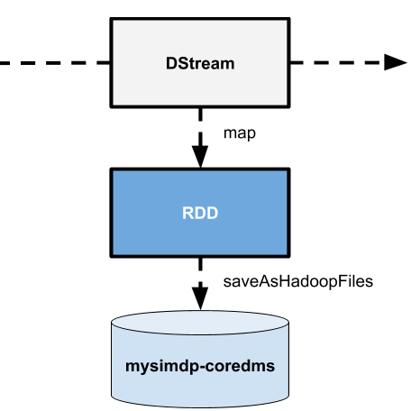

# System Design

## Part 1 - Design for streaming analytics

### 1. Dataset and customer cases

In this big data platform __mysimvdp__, two imaginary customers are used in testing and development process. Both of customers have multiple IoT sensors that are used in indoor localisation process. __Customer A__ is a municipal rest home for elderly and __Customer B__ is a small-size software company. With both customers, data consists of events that IoT sensors are streaming constantly (near real-time) with multiple sensors (i.e. each person within customer organization side has own unique sensor with own ID (key)).

Take a closer look for customers and their businesses:

#### Customer A

Customer A wants to use modern IoT technology to help nurses and other personnel in everyday life at elderly rest house. The personnel would monitor where each resident  currently is, and therefore it is easier to find them. In this case, __Customer A__ is simulated with three IoT sensors that connects to a local gateway in each room. The connection information will be sent into the __mysimbdp__. The available rooms in the elderly rest home are `living room`, `kitchen`, `hall` and `bathroom`. The event structure should be as below:
```json
{
  "part_id": 1084,
  "ts_date": "20191030",
  "ts_time": "14:06:35",
  "room": "living room",
}
```

In this example data set consists of events. Every event includes a timestamp (`ts_date` and `ts_time`), current room and sensor ID (`part_id`). The data is about indoor location to locate a single person in a building. The system could consists an application with each user, the gateway in every room that is sending event data into the cloud.

Data reference: Ilias Kalamaras. (2019). Indoor Localization Dataset [Data set]. Zenodo. http://doi.org/10.5281/zenodo.2671590


#### Customer B
Customer B is a small start-up company with business in recent AI and IoT methods. It has a small office with the following floor base:

The CTO of that company want to adjust the use of space and gives an IoT sensor for every employee. The CTO has set a local gateway into the all rooms.

(i) Streaming analytics could be used in receiving constantly generating events.

Possible analytics that customers require:

1) Machine learning models to determine how the rooms are used and modify and adjust the lighting system and air ventilation. MLlib in Spark Streaming could be used in this.

2) Count frequency: how many persons are in same room at the same time. If there are too many persons in a same room, the system would raise an alert to system monitors. Also, the usage of the rooms can be reviewed with a daily trend.

3) Simple analytics: If there is a person in a certain room, the system raises an alert. This analytics would be implemented later in this assignment.

(ii) A big data platform should save these events in database or csv-file. For example, if historical values are saved into a csv-file, they should follow the structure:

```csv
part_id,ts_date,ts_time,room
1084,20180315,18:02:36,hall
1084,20180315,18:02:44,livingroom
1084,20180315,18:27:12,kitchen
1084,20180315,18:27:28,livingroom
1084,20180315,18:27:36,kitchen
1084,20180315,18:28:53,livingroom
1084,20180315,18:29:23,hall
1084,20180315,18:29:37,livingroom
1084,20180319,11:09:51,livingroom
1085,20180314,13:51:35,hall
1085,20180314,13:51:43,livingroom
1085,20180315,17:59:06,hall
...
```
This historical batch data can be used further in training machine learning models to optimize how spaces are used during the day. For example, in __Customer B__ it is helpful to the company if all the spaces are efficiently used without greater waste of use.

In addition, __Customer A__ could train predictive machine learning models that tells where a resident would most likely be on that moment of the day. It would be helpful to nurses and other personnel to plan activities for the day.

### 2. Streaming analytics

(i) With this data, it would be better to handle keyed data streams for the customer data, because events can be grouped by keys (`part_id`). In the these data streams, keyed data is used to separate different data sources (in this case, different IoT sensors or persons with that sensor). It would be possible to create analytics about behavior of a single person. In the streaming platform, it is possible to split the stream based on keys.

The following figure describes how the keyed splitting can be done:




(ii) Each streaming event should have a timestamp and `part_id` at least. For each customer, it is possible to count how many sensor events occur in a window and how many rooms are certain person (holder of an IoT sensor) used during a window time. In order to determine reliable analytics, it is important that each event is processed only once. However, a failure might happen that confuses the stream processing. In order to handle failures, delivery guarantees should be thought. As a delivery guarantee, exactly-once should be a requirement in this streaming platform.

Ref: https://arxiv.org/pdf/1907.06250.pdf

### 3. Time and windows

(i) Time associated with data sources: in the data presented earlier, a date and the exact time is given. They are suitable when determining how spaces are used during the day and where most likely the sensor's owner is most likely found at certain time. In the big data platform, it is possible to determine latency when receiving data. As customer events provides the `event time` in variables `ts_date` and `ts_time`. The `event time` is the time when a customer goes into a room and his/her sensor connects to a local gateway. It is possible to determine the `processing time` comparing `event time` from the event to current time in the big data platform. `Ingestion time` corresponds the time when an individual sensor event is stored into a Kafka topic.

(ii) Windows used in the analytics: due to the nature of the data, windows of 24 hours for __Customer A__ could be realistic. With the windows of this size it is practical to monitor how sensor holders are moving in the house during a day. For example, if a person with `part_id` 1084 is a senior citizen living in a rest house, it is possible to draw a profile where he/she likes to stay and spend time. This information coming from many users can be used in improving the purpose of the spaces.

However, as the __Customer B__ is a company tracking space using and employees during a work day, it would be reasonable to use smaller windows. For example, 8 or 12 hour windows could be sufficient to track movements during the work day.

Ref: https://kafka.apache.org/23/documentation/streams/core-concepts

### 4. Performance metrics
Important performance metrics with this dataset is what is the latency in receiving data events. For example, in our customer cases it is important to get up-to-date information about sensor locations.

Apache Spark provides many performance metrics that would be useful. For example, the customers might want to know the latency between receiving a message and the processing. Also, from `inputMetrics`, there is a Spark executor metric called `recordsWritten`. That metric would be used in determining how well the system works and are there missed messages/records.

More:
https://spark.apache.org/docs/latest/monitoring.html


### 5. Streaming analytics platform architecture



As seen in the figure above, streaming data will be handled with Apache Kafka data broker to Apache Spark Streaming API.

A more detailed figure about customer streaming data. The data is generated constantly in IoT sensor in certain rate. As seen in the figure above, each sensor has its own topic where data is published.


## Part 2 - Implementation of streaming analytics


Apache Spark Streaming is used as a streaming analytics service in this big data platform. As Apache Kafka works as a data broker, the integration between Kafka and Spark is needed. To handle this integration, a direct approach is used instead of receiver-based approach. This approach requires Spark 2.4 for Python API. In receiver-based approach the system is implemented with Kafka API. The data will be received in Spark executors (see ref).

Ref: https://spark.apache.org/docs/latest/streaming-programming-guide.html

### 1. Message serialization/deserialization
Apache Spark is used in this big data platform and Apache Kafka is used as a message broker. The customer should start their IoT devices before starting streaming application. Also, Apache Kafka server should be started. However, these processes includes in a shell script provided to the customer.

In the implemented __customerstreamapp__, batches have a duration of 60 seconds. This is suitable, because in indoor localisation there is not as high requirement for speed as in autonomous driving, VR glasses or anything else which needs instant latency with very fast streaming.

Kafka messages are serialized with ASCII encoding into JSON dumps.
Data serialization: value_serializer=lambda m: json.dumps(m).encode('ascii'). Kafka messages are deserialized with json.loads.

__Message serialization__
```python
producer = KafkaProducer(value_serializer=lambda m: json.dumps(m).encode('ascii'))
topic_name = topic_name
producer.send(topic_name, message)
producer.flush()
```

__Message deserialization__
```python
DStream = windowedStream.map(lambda x: eventJSON(x[1])).filter(lambda x: len(x) > 0)

...

def eventJSON(message):
    '''
    Function to load json format messages. Return an JSON object or empty string in a case of non-JSON message.
    '''
    try:
        return json.loads(message)
    except Exception:
        return {}
```

### 2. Implemented functions
In the __customerstreamapp__ the user should choose his/her customer ID. In this toy example, two customers are supported: A and B. However, customer IDs should be more professional in a real-world situation and the customer should authenticate before getting access to big data platform controls.

Kafka direct streaming approach is used instead of receiver-based. That is, because data loss is easier to avoid with direct approach. In receiver-based approach, there should be log files to avoid possible data losses.

In addition, the input data stream is handled with Spark Streaming and divided into batches. Every batch has the same length which is defined in milliseconds. These batches are called DStreams and Kafka-Spark integration methods are used in creating DStreams from Kafka messages [3].

The __customerstreamapp__ is executed:
```shell
python3 customerstreampp customer_ID
```

The following script describes the main logic of the main program in __customerstreamapp__.
```python
if __name__ == "__main__":
    print('Welcome to customerstreamapp!\n')
    print('-----------------------------')
    #customer = 'A'
    customer = sys.argv[0]

    if customer == 'B':
        list_of_topics = ['0001', '0002', '0003', '0004']
        window_size = 43200000
    elif customer == 'A':
        list_of_topics = ['1084', '1085', '1086']
        window_size = 86400000
    stream = createStreamingContext(list_of_topics, window_size)
    print(stream)
```
In this toy-case, the lists of topics are hard-coded in a demo script.


The the streaming function, an integration between Apache Kafka message broker and Apache Spark streaming service:

Import libraries that are required in Kafka-Spark integration and streaming.
```python
from pyspark import SparkContext
from pyspark.streaming import StreamingContext
from pyspark.streaming.kafka import KafkaUtils
```

To run, Spark Streaming service needs a StreamingContext instance.

```python
def createStreamingContext(list_of_topics, window_size):
    '''
    Get data stream from Kafka broker
    '''

    # SparkContext
    sc = SparkContext(appName="PythonStreamingDirectKafka")
    # sc.setLogLevel("WARN")

    # Streaming context
    batch_duration = 6 # batch duration in seconds
    ssc = StreamingContext(sc,batch_duration)

    # Connect to Kafka and get DStream of input stream data
    kafkaStream = KafkaUtils.createDirectStream(ssc, list_of_topics, {"metadata.broker.list": "localhost:9092"})

    # windowed stream
    windowedStream = kafkaStream.window(window_size)

    # messages should be in JSON format
    #DStream = kafkaStream.map(lambda x: json.loads(x[1]))
    DStream = windowedStream.map(lambda x: eventJSON(x[1])).filter(lambda x: len(x) > 0)
    #lines = windowedStream.map(lambda x: x[1])
    # https://github.com/apache/spark/blob/v2.4.4/examples/src/main/python/streaming/sql_network_wordcount.py
    #test
    if numPartitions:
        try:
            DStream.repartition(numPartitions)

    DStream.pprint()

    # after streaming context and operations are defined, it is time to start streaming process
    ssc.start()
    ssc.awaitTermination()
    #startStreaming(stc)
```
The input message is deserialized from a JSON object. If the message/event is not in right format, the deserialization would return an empty string.
```python
def eventJSON(message):
    '''
    Function to load json format messages. Return an JSON object or empty string in a case of non-JSON message.
    '''
    # Reference: https://community.cloudera.com/t5/Support-Questions/How-to-parse-Streaming-Json-object/td-p/139577
    try:
        return json.loads(message)
    except Exception:
        return {}

```


Apache Spark Streaming service is started with the following function. Streaming process is running until the termination.
```python
def startStreaming(streamingContext):
    '''
    This function starts a Spark streaming
    '''
    # Start the streaming context
    streamingContext.start()
    streamingContext.awaitTermination()
```

A function to send analytics result back to customer side. Kafka broker is applied in this case as the customer wants results near real-time.
```python
def sendEventBroker(event, topic):
    '''
    This function sends a Spark batch into the Kafka broker
    '''
    databroker(event, topic)
```

Also, a program to receive analytics results from __customerstreamapp__ as drawn in architecture figure in Part 1:

```python
from mysimbdp import subscribe_stream
import json

 # A function to receive analytics results
def subscribe(topic_name):
    subscribe_stream(topic_name)
    pass

if __name__ == '__main__':
    topic_name = "results-A"
    stream = subscribe_stream(topic_name)
    print(stream)
    for msg in stream:
        print("Message")
        print(msg.value)
```

References: https://spark.apache.org/docs/2.2.0/streaming-kafka-0-8-integration.html

### 3. Tests and performance

It seems that the local system has not power enough to host platform properly. If trying to start servers, the system freezes and lost control. However, some logs were possible to get from the platform and at least the system is implemented. If there would be more time, the system shall be depolyed in the cloud or at least more powerful computer (that I don't own).

However, the system should be tested with different event types and rates.
The streaming system is designed to handle JSON messages from Kafka broker. If the message has non-JSON structure, the message will be filtered out from the stream. The platform handles a non-JSON message as an empty object as can be seen from the function below:
```python
DStream = kafkaStream.map(lambda x: eventJSON(x[1])).filter(lambda x: len(x) > 0)

def eventJSON(message):
    '''
    Function to load json format messages. Return an JSON object or empty string in a case of non-JSON message.
    '''
    # Reference: https://community.cloudera.com/t5/Support-Questions/How-to-parse-Streaming-Json-object/td-p/139577
    try:
        return json.loads(message)
    except Exception:
        return {}
```

To test __customerstreamapp__ and its performance, a simulated malfunctioned IoT sensor is created. This IoT sensor works as correct one, but sometimes it sends wrong data and data with different rates.
A test program __TEST_PERFORMANCE.py__ is implemented to test how the platform reacts when there are incorrect messages streaming in.
```python
from TEST_failure_IoT_sensor_1 import testSensor_1, testSensor_2

if __name__ == '__main__':
    '''
    Test streaming platform with wrong data
    '''
    ERROR_RATES = [0.01, 1, 10, 100, 1000] # different error rates
    MAX_ITER = 100 # number of messages will be sent
    for ERROR_RATE in ERROR_RATES:
        testSensor_1(ERROR_RATE, MAX_ITER)
        testSensor_2(ERROR_RATE, MAX_ITER)
```

In this test program, error rates are initalized with 0.01, 1, 10, 100, 1000. The error rate corresponds the time in seconds between messages.

__TEST_failure_IoT_sensor_1.py__
```python
from random import randrange
import time
from datetime import datetime
from mysimbdp import databroker
import json

'''
Simulated IoT sensor generating failing data.
'''

# SIMULATED IoT SENSOR for certain user
def testSensor_1(TEST_RATE, MAX_ITER=1000):
    '''
    Test sensor with very high sampling rate
    '''
    rooms = ['living room', 'kitchen', 'hall', 'bathroom']
    part_id = 1086
    run = 1
    topic_name = '1086'
    count = 0
    while 1:
        if count == MAX_ITER:
            return
        ts_date = datetime.today().strftime('%Y%m%d')
        ts_time = datetime.today().strftime('%H:%M:%S')
        room = randrange(4)
        message = {"part_id": part_id, "ts_date": ts_date, "ts_time": ts_time, "room": rooms[room]}

        #message = json.dumps(message)
        print(message)
        databroker(message, topic_name)
        time.sleep(TEST_RATE)
        count += 1

def testSensor_2(TEST_RATE, MAX_ITER=1000):
    '''
    Test sensor with wrong message format
    '''
    part_id = 1086
    run = 1
    topic_name = '1086'
    count = 0
    while 1:
        if count == MAX_ITER:
            return
        ts_date = datetime.today().strftime('%Y%m%d')
        ts_time = datetime.today().strftime('%H:%M:%S')
        message = "part_id: 1086 ts_date: 20191110 ts_time: 20:55:00 room: kitchen"

        #message = json.dumps(message)
        print(message)
        databroker(message, topic_name)
        time.sleep(TEST_RATE)
        count += 1
```

The fault tolerance of Spark Streaming should works if there are exceptions and failures. The aim is that the platform doesn't break down when encountering a failure. Also, the environment can be tested with shutting down the sensors and check what happens.



Actually, in the figure above, the result of shutted down sensor is visible. The rate changes.

### 5. Parallelism
In Spark Streaming, the level of parallelism can be changed with DStream transformation `repartition(numPartitions)`. For example, in __customerstreamapp__ there would the following code:

```python
def createStreamingContext(list_of_topics, window_size, numPartitions=None):

...

if numPartitions:
    try:
        DStream.repartition(numPartitions)
```
This code changes the level of parallelism of the input stream with creating more or fewer partitions with number of `numPartitions`. By default, the repartition is not conducted (`numPartitions=None`).

To test this function, a parallelism test function is defined:
```python
from customerstreamapp import createStreamingContext

if __name__ == "__main__":
    print('Welcome to customerstreamapp!\n')
    print('-----------------------------')
    customer = 'A'
    #customer = str(sys.argv[0])

    if customer == 'B':
        list_of_topics = ['0001', '0002', '0003', '0004']
        window_size = 43200000
    elif customer == 'A':
        list_of_topics = ['1084', '1085', '1086']
        window_size = 86400000

    numPartitions = 5 # 10, 50, 100
    stream = createStreamingContext(list_of_topics, window_size, numPartitions)

```

References:
[2] Databricks Blog: Real-time End-to-end Integration with Apache Kafka in Apache Spark's Structured Streaming, URL: https://databricks.com/blog/2017/04/04/real-time-end-to-end-integration-with-apache-kafka-in-apache-sparks-structured-streaming.html [Accessed 18.11.2019].
[3] https://mapr.com/blog/real-time-streaming-data-pipelines-apache-apis-kafka-spark-streaming-and-hbase/

## Part 3 - Connection
### 1. Analytics storing into coredms
There should be little modifications in order to store analytics results into __mysimbdp-coredms__. The DStream from Spark Streaming service should be pushed out to MongoDB (or any other database, but MongoDB is used in this case). Thus, the DStream contents should be saved into a file and then convert to JSON and pushed out to MongoDB. There is a __pymongo-spark__ library availabel to integrate Spark Streaming and MongoDB: https://github.com/mongodb/mongo-hadoop/tree/master/spark/src/main/python. This would be useful in further implementations.

As seen in the figure below, one implementation would be to connect MongoDB database into the output message broker.



On the other hand, Hadoop File System could also work as a __mysimbdp-coredms__. In the Hadoop case, there is an existing function __saveAsHadoopFiles__.



```python

stream_mapped = stream.map()
file = stream_mapped.saveAsHadoopFiles
```


### 2. Batch analytics
A batch analytics that could be used to historical data: for example, counting how many rooms each person are visiting during a day or counting what is the most popular room and which room is with little use.

As stream is handled with keyed method (`part_id` as a key). Example analytics for counting times for each person visiting in certain room:

__Example: Statistics for 27-11-2019__

| part_id | living room | kitchen | hall | bathroom |
|---------|-------------|---------|------|----------|
| 1084    | 5           | 2       | 10   | 3        |
| 1085    | 10          | 1       | 8    | 2        |
| 1086    | 2           | 10      | 2    |3         |

The analytics would be interesting to see in some dashboard format. For example, batch data can be read from the database into the dashboard provider such as Cognos Analytics (platform for Business intelligence) or some other provider.

### 3. Scaling
As the stream processing works with Apache Spark, it is possible to allow dynamic allocation. Sparks enables to adding and removing executors depending on workload.

There are couple of settings that should be done before dynamic allocation is possible:
```python
spark.dynamicAllocation.enable = True
spark.dynamicAllocation.minExecutors = 1
spark.dynamicAllocation.maxExecutors = 100
```

Ref:
https://medium.com/@pmatpadi/spark-streaming-dynamic-scaling-and-backpressure-in-action-6ebdbc782a69
https://towardsdatascience.com/how-does-facebook-tune-apache-spark-for-large-scale-workloads-3238ddda0830
### 4. End-to-end delivery guarantees

In exactly once semantics, no data should be lost at any point.
As this platform uses Apache Kafka 0.8 as a data broker, it would not be possible to reach end-to-end exactly once delivery when [1] says that exactly once is  possible from Kafka versions 0.11.0. However, Apache Kafka is a replayable data source [2] that should provide a missed message again if a failure occurs. The article in [2] provides good instructions to build a end-to-end exactly once streaming system with Apache Spark by using checkpoints for drivers and idempotent sinks.

- [1] https://kafka.apache.org/23/documentation/streams/core-concepts
- [2] https://docs.microsoft.com/en-us/azure/hdinsight/spark/apache-spark-streaming-exactly-once
